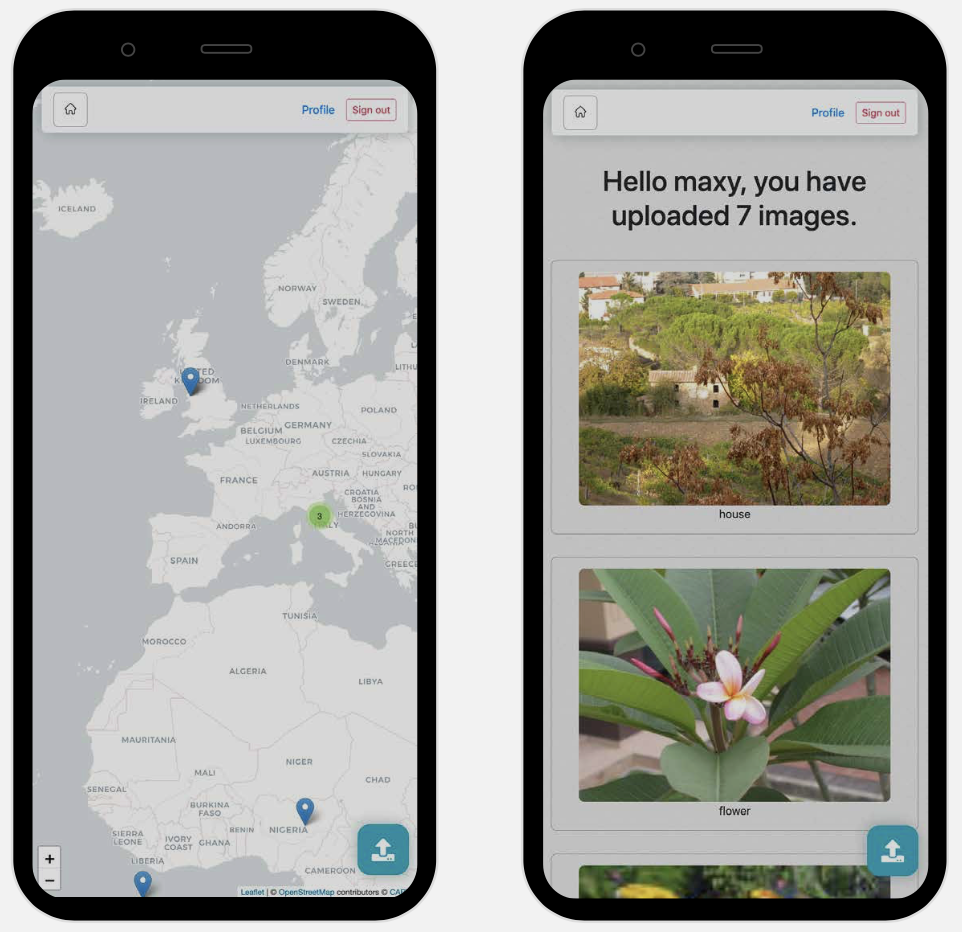

# mapping-images
Geographically mapping images onto a web-based map.

---

---
This repo contains the code from my dissertation project - "Digitally referencing images to a geographical location to aid memory recall"

Technologies used: 
- JQuery 
- PHP
- Apache
- [LeafletJS](https://leafletjs.com)
- SASS
- Exif data

Enables users to upload thier own images onto a web-based map, using [LeafletJS](https://leafletjs.com). Images are then checked for their corresponding Longitude and Latitude, using Exif data; which most images should have. Although, not all images contain this data: uploading/backing images up online may strip it. As such, the user can also input their own location into the webpage.

In my dissertation report I have a section detailing how to secure Apache servers, annoyingly I didn't save my end config file. However, it will soon be available on [my website](https://maxpetts.me)

In hindsight this project used old technologies such as JQuery, and was hosted off my 2017 MacBook Pro - which would've hindered performance. Had I tackled this problem with the knowledge I have now I would've used modern frameworks and utilities; like Next.js or Gatsby. 
However, I am still proud of the results as it demonstrates the concept well; albeit without ideal performance. 
